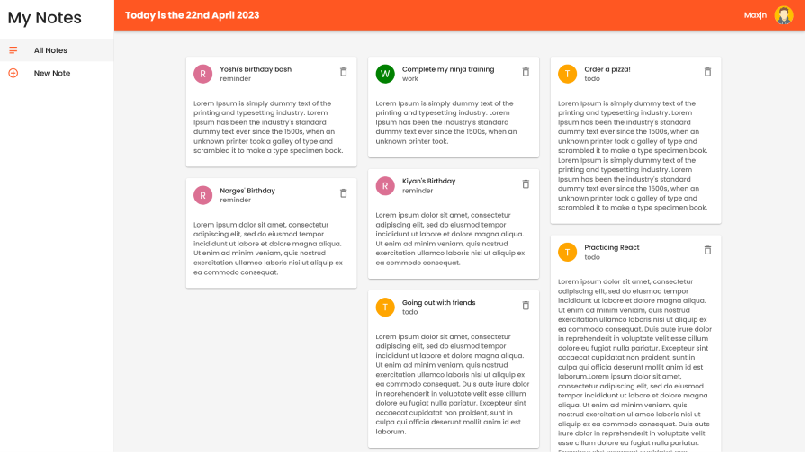
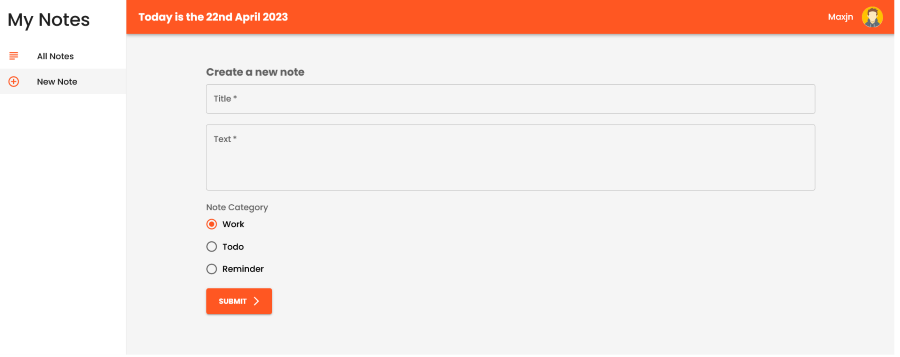

# Note - Material UI Practice

This is a simple practical application for practicing Material Ui library. It has two pages one for showing notes and one for adding notes .

This project was bootstrapped using [Vite](https://vitejs.dev/).

## Technologies

- HTML,CSS
- ES6
- React
- **Material UI**
- **react-router-dom** package for routing
- **Hooks:** useNavagate, useLocation, useState,useEffect

## Features

- Masonary
- Form & Inputs
- Grid
- Typography
- Cards
- AppBar
- List
- ...

## Installation

Install **note-material** with npm

```shell
npm install

npm run start

json-server -p 8000 -w data/db.json
```

## Screenshots



